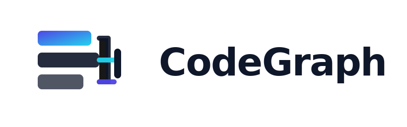
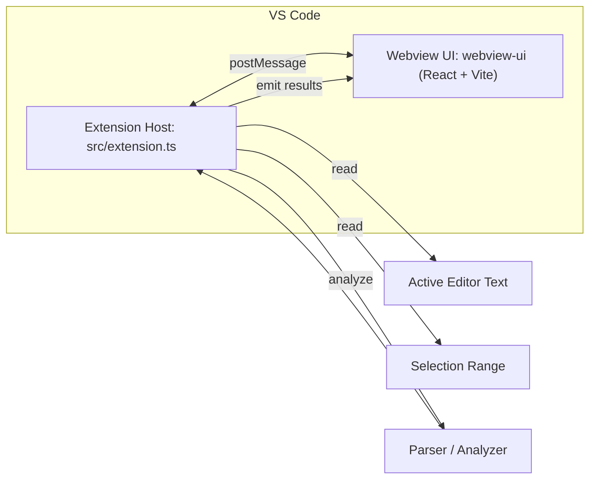
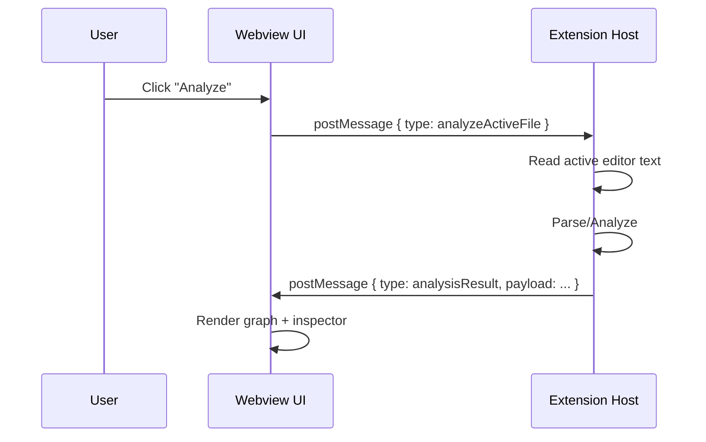
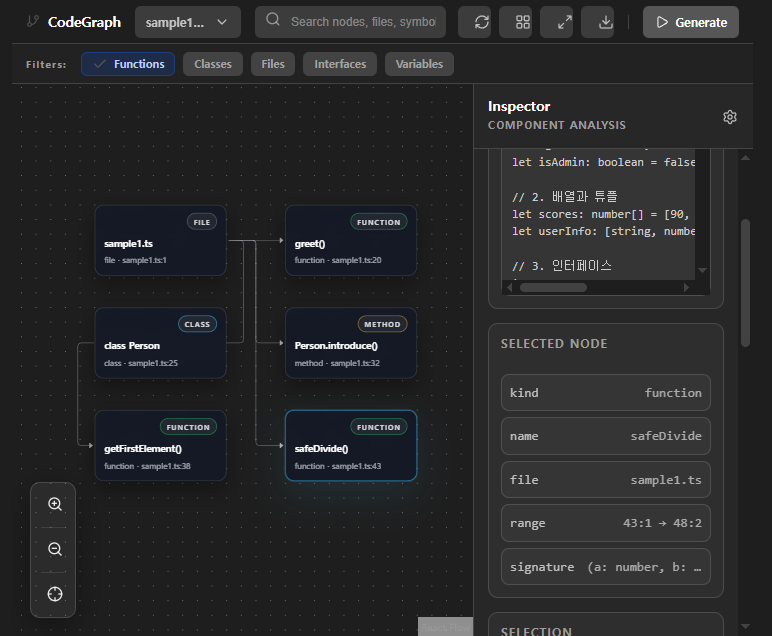

<h1 align="center">CodeGraph (VS Code Extension + Webview)</h1>

<p align="center">
  
</p>

<p align="center">
  CodeGraph는 <b>VS Code 확장(Extension Host)</b>과 <b>Webview(React + Vite)</b>로 구성된 코드 분석/시각화 도구의 MVP입니다.
</p>

---

## Architecture Overview

CodeGraph는 **VS Code Extension Host**(백엔드 역할)와 **Webview UI**(프론트 역할)로 구성됩니다.

- **Extension Host**: VS Code API 접근(Active Editor/Selection/Workspace) + 분석 트리거 + Webview에 결과 전달
- **Webview UI**: React 기반 시각화/Inspector + 사용자 인터랙션(Analyze 등) + Extension에 요청 송신



---

## Message Protocol (Extension ↔ Webview)

Webview는 `window.acquireVsCodeApi()`로 Extension에 메시지를 보내고, Extension은 결과를 다시 전달합니다.

### Request (Webview → Extension)

| type                | payload        | 설명                            |
| ------------------- | -------------- | ------------------------------- |
| `requestActiveFile` | 없음           | 현재 활성 파일 텍스트 요청      |
| `requestSelection`  | 없음           | 현재 Selection 범위/텍스트 요청 |
| `analyzeActiveFile` | `{ options? }` | 현재 파일 분석 실행 요청        |

### Response (Extension → Webview)

| type             | payload                        | 설명                        |
| ---------------- | ------------------------------ | --------------------------- |
| `activeFile`     | `{ uri, text }`                | 활성 파일 정보              |
| `selection`      | `{ range, text }`              | 선택 영역 정보              |
| `analysisResult` | `{ graph, diagnostics, meta }` | 분석 결과(그래프/메타/진단) |
| `error`          | `{ message, detail? }`         | 오류 전달                   |



---

## Requirements

- Node.js LTS 권장 (18+)
- VS Code 최신 버전 권장

---

## Install

```bash
npm install
cd webview-ui
npm install
```

---

## Development Workflow

### 1) Webview UI Dev (빠른 UI 반복 작업)

```bash
cd webview-ui
npm run dev
```

- UI를 빠르게 개발할 때 사용합니다.
- 실제 VS Code 메시징 환경과 100% 동일하진 않으므로, 통합 테스트는 아래 Extension Debug로 수행합니다.

### 2) Extension Debug (VS Code에서 실행)

- VS Code에서 `Run and Debug` → Extension 실행(F5)
- 새로 뜨는 Extension Development Host에서 CodeGraph 커맨드 실행

---

## Build

### build:all (권장)

레포 루트에서 **한 번에** Webview 빌드 + 산출물 복사 + Extension 빌드를 수행합니다.

```bash
npm run build:all
```

> `build:all` 스크립트는 일반적으로 아래 순서를 따릅니다.
>
> 1. `webview-ui` 빌드 (`vite build`)
> 2. `webview-ui/dist` → `media/webview/`로 copy
> 3. Extension TypeScript 빌드 (`tsc -b` 또는 `tsc`)

#### (참고) package.json 예시

프로젝트가 아직 `build:all`을 정의하지 않았다면, 아래 형태로 구성하는 것이 실용적입니다.  
(현재 레포 구성에 맞게 copy 경로/명령만 조정하면 됩니다.)

```jsonc
{
  "scripts": {
    "build:ui": "npm --prefix webview-ui run build",
    "copy:ui": "node scripts/copy-webview.js",
    "build:ext": "tsc -b",
    "build:all": "npm run build:ui && npm run copy:ui && npm run build:ext",
  },
}
```

---

## Repo Structure

```text
.
├─ src/                        # VS Code extension source
├─ webview-ui/                 # React + Vite webview UI
├─ media/webview/              # webview build output (generated)
├─ scripts/                    # build/copy scripts (if present)
├─ package.json
└─ README.md
```

Build 시 `webview-ui`의 결과물이 `media/webview/`로 복사되어, Extension이 로컬 리소스로 로드합니다.

---

## Graph Data Model (MVP)

분석 결과는 노드/엣지 기반 그래프 모델로 전달됩니다.  
(실제 payload와 다르면, 이 블록만 현재 스키마에 맞춰 교체하면 됩니다.)

```ts
type Graph = {
  nodes: Array<{
    id: string;
    kind: "function" | "class" | "variable" | "call" | "module" | string;
    label: string;
    meta?: Record<string, unknown>;
  }>;
  edges: Array<{
    id: string;
    from: string;
    to: string;
    kind: "calls" | "imports" | "references" | string;
    meta?: Record<string, unknown>;
  }>;
  diagnostics?: Array<{
    level: "info" | "warn" | "error";
    message: string;
    range?: { start: number; end: number };
  }>;
};
```

---

## Screenshots

| Demo                      | Inspector                      |
| ------------------------- | ------------------------------ |
|  |  |

<!-- > `assets/` 아래에 스크린샷을 추가해 주세요. -->

---

## Roadmap

- [ ] Analyzer 확장: 함수 호출 그래프(Call Graph) 정확도 개선
- [ ] Selection 기반 분석: 선택 구간만 부분 분석/하이라이트
- [ ] Graph Interaction: 노드 클릭 → 원본 코드 위치 reveal
- [ ] Performance: 대형 파일 incremental analyze + debounce
- [ ] Export: JSON/SVG/PNG 내보내기
