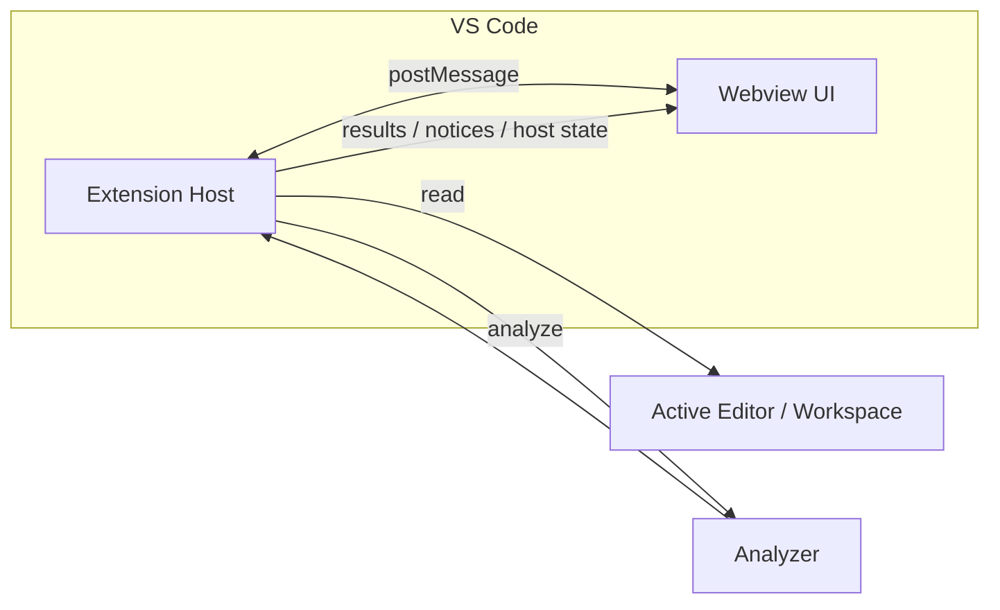

# CodeGraph

<p align="center">
  
</p>

<p align="center">
  VS Code extension + React webview for exploring TypeScript/JavaScript code as an interactive graph.
</p>

---

## Overview

CodeGraph analyzes the active TypeScript/JavaScript file and renders a graph of files, symbols, and relationships inside VS Code.

It supports two host modes:

- `Sidebar View`: a docked webview inside the CodeGraph activity bar container
- `Editor Panel`: a detachable webview panel that opens like a normal editor tab

The extension is split into two parts:

- `src/`: VS Code extension host, workspace access, analysis, commands, debugger wiring
- `webview-ui/`: React + Vite graph UI rendered inside the webview

---

## Demo


## Node Click Walkthrough


## Trace Walkthrough


## Runtime Debug Walkthrough


## Error Demo


---

## Core Features

- Analyze the active TypeScript/JavaScript file and render an interactive graph
- Render `file`, `function`, `method`, `class`, `interface`, `type`, `enum`, and `external` nodes
- Render `calls`, `constructs`, `references`, `updates`, and `dataflow` edges
- Open CodeGraph either in the sidebar or in a separate editor panel
- Switch host mode directly from Inspector settings:
  - `Sidebar Left`
  - `Sidebar Right`
  - `Editor Panel`
- Move the Inspector between:
  - `Auto`
  - `Left`
  - `Right`
  - `Bottom`
- Search nodes, files, and symbols from the top bar
- Filter visible graph content by chip:
  - `All`
  - `Functions`
  - `Classes`
  - `Files`
  - `Interfaces`
  - `Variables`
- Group results as `folder -> file -> symbol`
- Collapse and expand folder groups and file groups
- Keep the active file and active folder open by default while other groups start collapsed
- Support root selection flows such as "use selection as root"
- Highlight focused parameter-flow edges and surface them in the Inspector
- Expand external nodes into the current graph
- Follow VS Code debugger state and map the paused frame onto the graph
- Export the current graph as structured JSON or a JPG snapshot

---

## Opening CodeGraph

You can open CodeGraph in two ways.

### Commands

- `CodeGraph: Open Editor Panel`
- `CodeGraph: Focus Sidebar View`

Internal command ids:

- `codegraph.open`
- `codegraph.openSidebar`

### Activity Bar

The extension contributes a `CodeGraph` activity bar icon. Opening it focuses the sidebar-hosted webview view.

---

## Graph Model

The analyzer currently emits a graph with:

```ts
type GraphPayload = {
  nodes: Array<{
    id: string;
    kind: "file" | "function" | "method" | "class" | "interface" | "external";
    name: string;
    file: string;
    parentId?: string;
    range: {
      start: { line: number; character: number };
      end: { line: number; character: number };
    };
    signature?: string;
    sig?: {
      params: Array<{ name: string; type: string; optional?: boolean }>;
      returnType?: string;
    };
    subkind?: "interface" | "type" | "enum";
  }>;
  edges: Array<{
    id: string;
    kind: "calls" | "constructs" | "dataflow" | "references" | "updates";
    source: string;
    target: string;
    label?: string;
  }>;
};
```

Notes:

- folder groups are currently a UI/layout layer, not analyzer graph nodes
- folder grouping is used to organize file groups in depth-expanded graphs

---

## Canvas Behavior

### Node and Group Interaction

- `Single click` on a node selects it
- `Double click` on a node opens the matching source location
- child symbol rows inside compound nodes support selection and navigation
- folder groups and file groups can be collapsed and expanded
- when graph re-layout happens after opening a folder or file, the camera follows the interacted target

### Top Bar

The top bar supports:

- active file selection
- depth selection
- graph search
- refresh/re-analyze actions
- layout/graph utilities
- export actions

### Parameter Flow

- parameter/data-flow edges are rendered in a dedicated lane
- focused parameter flow is highlighted on the canvas
- parameter flow details are shown in the Inspector
- parameter flow overlays are layered above normal edges, while Inspector/canvas overlay panels remain above them

---

## Inspector

The Inspector is now both a detail pane and a settings surface.

### Inspector Content Sections

- `Active File Snapshot`
- `Root`
- `Runtime Frame`
- `Selected Node`
- `Selection`
- `Param Flow`
- `Analysis`

### Inspector Settings

Clicking the settings icon switches the Inspector itself into settings mode.

Inside settings mode you can:

- switch display mode between sidebar-left, sidebar-right, and editor-panel
- change Inspector placement between auto, left, right, and bottom
- show or hide sections
- reorder sections
- drag sections to reorder them

Section layout preferences are persisted locally in the webview.

---

## Trace Mode

Trace mode helps explain how CodeGraph built the current graph.

- trace playback steps through graph construction events
- newly introduced trace nodes are visually focused
- parameter-flow trace steps highlight the active flow edge
- the Inspector surfaces the currently focused trace flow

Use Trace mode when you want to understand graph construction rather than runtime execution.

---

## Runtime Debug Mode

Debug mode listens to VS Code debug sessions and maps the paused runtime frame onto the existing graph.

- reads the current paused stack frame from VS Code
- matches `file/line` data back to graph nodes
- highlights the runtime-active node
- shows frame information in the Inspector
- shows a compact set of important variables
- supports stepping through code while the graph focus updates

Recommended flow:

1. Open the target file.
2. Generate the graph.
3. Start a normal VS Code debug session with breakpoints.
4. Let execution pause.
5. Step through code and watch CodeGraph follow the runtime frame.

### Trace Mode vs Debug Mode

| Mode | What it shows | Source of truth | Best for |
| --- | --- | --- | --- |
| `Trace Mode` | how the graph was constructed | analyzer trace events | understanding graph generation |
| `Debug Mode` | where execution is currently paused | VS Code debugger state | following real runtime execution |

---

## Export

### JSON Export

The JSON export saves:

- graph nodes and edges
- active file information
- analysis metadata
- UI state such as filter, search query, selection, root, and Inspector layout

Example schema:

```json
{
  "schema": "codegraph.flow.v1",
  "exportedAt": "2026-03-20T06:27:10.416Z",
  "ui": {
    "activeFilter": "all",
    "searchQuery": "",
    "rootNodeId": null,
    "selectedNodeId": null,
    "inspector": {
      "open": true,
      "placement": "right",
      "effectivePlacement": "right",
      "width": 370,
      "height": 396
    }
  },
  "activeFile": {
    "uri": "file:///path/to/file.ts",
    "fileName": "file.ts",
    "languageId": "typescript"
  },
  "analysisMeta": {
    "mode": "workspace"
  },
  "graph": {
    "nodes": [],
    "edges": []
  }
}
```

### JPG Snapshot

The JPG export captures the current graph canvas as an image.

Notes:

- it is a rendered snapshot, not a structured format
- overlay controls and utility chrome are filtered out where possible
- it is useful for issues, docs, chat, and quick sharing

---

## Message Protocol

### Webview -> Extension

| Type | Description |
| --- | --- |
| `requestActiveFile` | Request current active editor info |
| `requestWorkspaceFiles` | Request workspace root and file list |
| `requestSelection` | Request current editor selection |
| `requestHostState` | Request current host kind and sidebar location |
| `analyzeActiveFile` | Analyze the active file |
| `analyzeWorkspace` | Analyze from workspace context |
| `selectWorkspaceFile` | Open a file from the workspace picker |
| `expandNode` | Analyze and merge graph data for an external file |
| `setGraphDepth` | Update graph depth |
| `openLocation` | Reveal a source location in the editor |
| `saveExportFile` | Save a JSON or JPG export through VS Code |
| `switchHost` | Switch between sidebar and editor panel, optionally changing sidebar side |

### Extension -> Webview

| Type | Description |
| --- | --- |
| `activeFile` | Active editor payload |
| `workspaceFiles` | Workspace root and file list |
| `selection` | Current selection payload |
| `analysisResult` | Graph, diagnostics, trace, and metadata |
| `runtimeDebug` | Debug session, frame, and variable snapshot |
| `hostState` | Current host kind and sidebar location |
| `uiNotice` | Toast/canvas/inspector notice |
| `flowExportResult` | Result of JSON/JPG export save |

---

## Architecture


```mermaid
flowchart LR
  subgraph VSCode[VS Code]
    EH["Extension Host"]
    WV["Webview UI"]
  end

  EH <-->|postMessage| WV
  EH -->|read| AE["Active Editor / Workspace"]
  EH -->|analyze| AST["Analyzer"]
  AST --> EH
  EH -->|results / notices / host state| WV
```

---

## Requirements

- Node.js 18+
- VS Code 1.108+

---

## Install

```bash
npm install
cd webview-ui
npm install
```

---

## Development

### Run the webview UI build

```bash
cd webview-ui
npm run build
```

### Run the extension

Open the repo in VS Code and press `F5` to launch an Extension Development Host.

### Build everything

```bash
npm run build:all
```

This runs:

1. the webview build
2. webview asset copy into `media/webview`
3. extension TypeScript compile

---

## Repo Structure

```text
.
|-- src/                # VS Code extension source
|-- webview-ui/         # React + Vite webview UI
|-- media/webview/      # generated webview build output
|-- scripts/            # helper scripts
|-- assets/             # logos and demo assets
|-- package.json
`-- README.md
```

---

## Current Notes

- best supported target is TypeScript/JavaScript code inside a normal VS Code workspace
- folder grouping is visual organization, not part of the analyzer graph schema
- sidebar-right support works by switching the VS Code sidebar location
- sidebar and editor panel can both be used, but they are separate webview hosts

---

## Roadmap

- [ ] export full graph bounds instead of only the visible rendered canvas region
- [ ] add import support for previously exported JSON graph files
- [ ] improve analyzer precision for call graph and external references
- [ ] incremental analysis for larger workspaces
- [ ] add more export presets such as PNG or SVG
