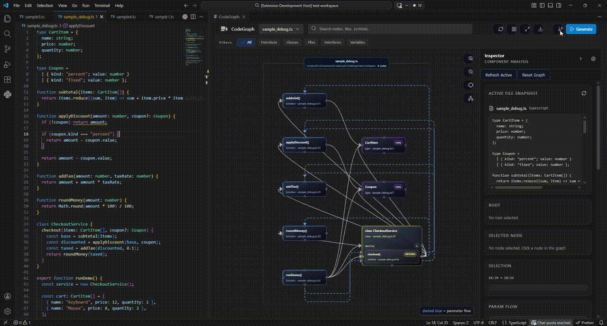
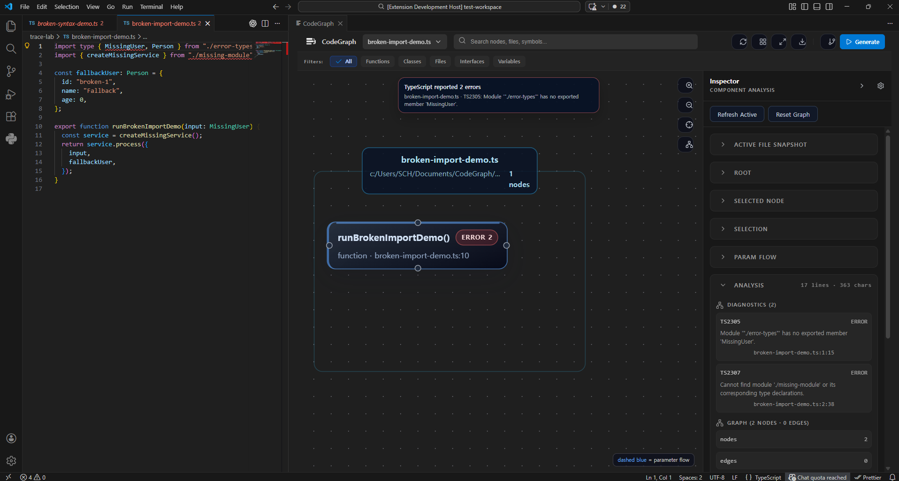
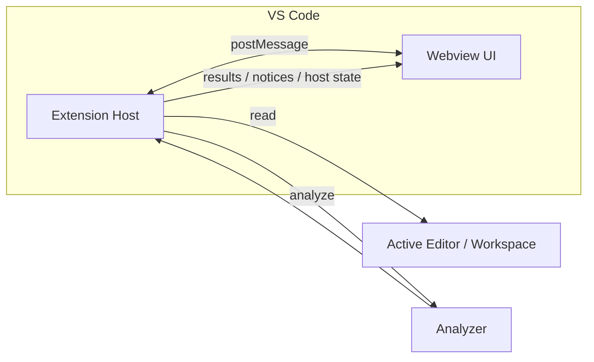

# CodeGraph

<p align="center">
  
</p>

<p align="center">
  VS Code 안에서 TypeScript/JavaScript 코드를 인터랙티브 그래프로 탐색하기 위한 확장 + React 웹뷰 UI입니다.
</p>

---

## 개요

CodeGraph는 현재 활성화된 TypeScript/JavaScript 파일을 분석하고, 파일/심볼/관계를 그래프로 렌더링합니다.

CodeGraph는 두 가지 호스트 모드를 지원합니다.

- `Sidebar View`: CodeGraph activity bar 컨테이너 안에 도킹되는 사이드바 웹뷰
- `Editor Panel`: 일반 에디터 탭처럼 열리는 분리형 웹뷰 패널

프로젝트는 크게 두 부분으로 나뉩니다.

- `src/`: VS Code extension host, 워크스페이스 접근, 분석, 명령어, 디버거 연동
- `webview-ui/`: 웹뷰 안에서 렌더링되는 React + Vite 기반 그래프 UI

---

## 데모


## 노드 클릭 데모


## Trace 데모



## Runtime Debug 데모


## 에러 데모



---

## 핵심 기능

- 활성 TypeScript/JavaScript 파일을 분석하고 인터랙티브 그래프 렌더링
- `file`, `function`, `method`, `class`, `interface`, `type`, `enum`, `external` 노드 표시
- `calls`, `constructs`, `references`, `updates`, `dataflow` 엣지 표시
- 사이드바와 에디터 패널 두 방식으로 CodeGraph 열기 지원
- Inspector 설정에서 바로 호스트 모드 전환 지원
  - `Sidebar Left`
  - `Sidebar Right`
  - `Editor Panel`
- Inspector 위치 변경 지원
  - `Auto`
  - `Left`
  - `Right`
  - `Bottom`
- 상단 검색창에서 노드, 파일, 심볼 검색
- 필터 칩으로 그래프 내용 필터링
  - `All`
  - `Functions`
  - `Classes`
  - `Files`
  - `Interfaces`
  - `Variables`
- `folder -> file -> symbol` 구조로 시각 그룹화
- 폴더 그룹 / 파일 그룹 접기와 펼치기 지원
- 현재 활성 파일과 활성 파일이 속한 폴더는 기본 펼침, 나머지는 기본 접힘
- 선택 영역을 root로 사용하는 흐름 지원
- parameter flow 엣지 하이라이트 및 Inspector 연동
- external 노드를 현재 그래프 안으로 확장
- VS Code 디버거 상태를 따라가며 현재 paused frame을 그래프에 매핑
- 현재 그래프를 JSON 또는 JPG로 export

---

## CodeGraph 열기

CodeGraph는 두 가지 방식으로 열 수 있습니다.

### 명령어

- `CodeGraph: Open Editor Panel`
- `CodeGraph: Focus Sidebar View`

내부 command id:

- `codegraph.open`
- `codegraph.openSidebar`

### Activity Bar

확장은 `CodeGraph` activity bar 아이콘을 추가합니다. 이 아이콘을 열면 사이드바 웹뷰가 포커스됩니다.

---

## 그래프 모델

현재 analyzer는 아래 구조의 그래프를 생성합니다.

```ts
type GraphPayload = {
  nodes: Array<{
    id: string;
    kind: "file" | "function" | "method" | "class" | "interface" | "external";
    name: string;
    file: string;
    parentId?: string;
    range: {
      start: { line: number; character: number };
      end: { line: number; character: number };
    };
    signature?: string;
    sig?: {
      params: Array<{ name: string; type: string; optional?: boolean }>;
      returnType?: string;
    };
    subkind?: "interface" | "type" | "enum";
  }>;
  edges: Array<{
    id: string;
    kind: "calls" | "constructs" | "dataflow" | "references" | "updates";
    source: string;
    target: string;
    label?: string;
  }>;
};
```

참고:

- 폴더 그룹은 analyzer graph node가 아니라 UI/레이아웃 계층입니다.
- depth 확장 시 많은 파일을 정리해서 보여주기 위해 폴더 그룹을 사용합니다.

---

## 캔버스 동작

### 노드 및 그룹 상호작용

- `Single click`: 노드 선택
- `Double click`: 해당 소스 위치 열기
- compound node 내부 child symbol row도 선택/이동 지원
- 폴더 그룹과 파일 그룹은 접기/펼치기 가능
- 폴더/파일을 열어서 재배치가 일어나면, 카메라는 방금 상호작용한 대상을 따라감

### Top Bar

상단 바에서는 다음 기능을 사용할 수 있습니다.

- 활성 파일 선택
- depth 선택
- 그래프 검색
- refresh / 재분석
- 레이아웃 및 그래프 유틸리티
- export

### Parameter Flow

- parameter/data-flow 엣지는 별도 lane으로 렌더링
- 현재 포커스된 parameter flow를 캔버스에서 강조
- Inspector에서 현재 flow 상세 정보 표시
- parameter flow overlay는 일반 엣지보다 위에 보이고, Inspector/캔버스 overlay 패널은 그보다 위에 표시

---

## Inspector

Inspector는 상세 정보 패널이자 설정 화면 역할도 함께 합니다.

### Inspector 섹션

- `Active File Snapshot`
- `Root`
- `Runtime Frame`
- `Selected Node`
- `Selection`
- `Param Flow`
- `Analysis`

### Inspector 설정

설정 아이콘을 누르면 작은 팝업이 뜨는 대신, Inspector 자체가 설정 화면으로 전환됩니다.

설정 화면에서 할 수 있는 일:

- display mode 변경
  - `Sidebar Left`
  - `Sidebar Right`
  - `Editor Panel`
- Inspector 위치 변경
  - `Auto`
  - `Left`
  - `Right`
  - `Bottom`
- 섹션 숨김/표시
- 섹션 순서 변경
- 드래그로 섹션 재정렬

섹션 레이아웃 설정은 웹뷰 로컬 상태로 저장됩니다.

---

## Trace 모드

Trace 모드는 CodeGraph가 현재 그래프를 어떻게 만들었는지 설명하는 데 초점이 있습니다.

- 그래프 구성 이벤트를 순차적으로 재생
- 새로 등장한 trace 노드를 시각적으로 강조
- parameter-flow trace 단계에서 해당 flow 엣지 강조
- Inspector에 현재 trace flow 정보 표시

그래프 생성 과정을 이해하고 싶을 때 적합합니다.

---

## Runtime Debug 모드

Debug 모드는 VS Code 디버그 세션과 연결되어 현재 paused frame을 기존 그래프에 매핑합니다.

- 현재 paused stack frame을 읽음
- `file/line` 정보를 그래프 노드와 매칭
- runtime-active node 강조
- Inspector에 frame 정보 표시
- 핵심 변수 목록 표시
- Step Over / Step Into 같은 디버그 이동 시 그래프 포커스 갱신

추천 흐름:

1. 대상 파일을 엽니다.
2. 그래프를 생성합니다.
3. 일반 VS Code 디버그 세션을 시작합니다.
4. 실행이 pause되도록 합니다.
5. step 하면서 CodeGraph가 runtime frame을 따라가는지 봅니다.

### Trace 모드와 Debug 모드 차이

| 모드 | 보여주는 것 | 기준 데이터 | 적합한 용도 |
| --- | --- | --- | --- |
| `Trace Mode` | 그래프가 어떻게 만들어졌는지 | analyzer trace event | 그래프 생성 과정 이해 |
| `Debug Mode` | 현재 실행이 어디에 멈춰 있는지 | VS Code debugger 상태 | 실제 런타임 흐름 추적 |

---

## Export

### JSON Export

JSON export에는 다음 내용이 포함됩니다.

- graph nodes / edges
- active file 정보
- analysis metadata
- filter, search query, selection, root, Inspector layout 같은 UI 상태

예시 스키마:

```json
{
  "schema": "codegraph.flow.v1",
  "exportedAt": "2026-03-20T06:27:10.416Z",
  "ui": {
    "activeFilter": "all",
    "searchQuery": "",
    "rootNodeId": null,
    "selectedNodeId": null,
    "inspector": {
      "open": true,
      "placement": "right",
      "effectivePlacement": "right",
      "width": 370,
      "height": 396
    }
  },
  "activeFile": {
    "uri": "file:///path/to/file.ts",
    "fileName": "file.ts",
    "languageId": "typescript"
  },
  "analysisMeta": {
    "mode": "workspace"
  },
  "graph": {
    "nodes": [],
    "edges": []
  }
}
```

### JPG Snapshot

JPG export는 현재 그래프 캔버스를 이미지로 저장합니다.

참고:

- 구조화된 그래프 포맷이 아니라 렌더된 스냅샷입니다.
- overlay 컨트롤이나 유틸리티 UI는 가능한 한 제외해서 저장합니다.
- 이슈 공유, 문서, 채팅에 빠르게 붙일 때 유용합니다.

---

## 메시지 프로토콜

### Webview -> Extension

| Type | 설명 |
| --- | --- |
| `requestActiveFile` | 현재 active editor 정보 요청 |
| `requestWorkspaceFiles` | workspace root / file list 요청 |
| `requestSelection` | 현재 editor selection 요청 |
| `requestHostState` | 현재 host kind와 sidebar 위치 요청 |
| `analyzeActiveFile` | 현재 active file 분석 |
| `analyzeWorkspace` | workspace 기준 분석 |
| `selectWorkspaceFile` | workspace picker에서 파일 열기 |
| `expandNode` | external file을 분석해서 현재 graph에 병합 |
| `setGraphDepth` | graph depth 변경 |
| `openLocation` | 소스 위치 열기 |
| `saveExportFile` | JSON/JPG export를 VS Code 저장 다이얼로그로 저장 |
| `switchHost` | sidebar / editor panel 전환, 필요 시 sidebar 방향도 변경 |

### Extension -> Webview

| Type | 설명 |
| --- | --- |
| `activeFile` | active editor payload |
| `workspaceFiles` | workspace root / file list |
| `selection` | 현재 selection payload |
| `analysisResult` | graph, diagnostics, trace, metadata |
| `runtimeDebug` | debug session, frame, variable snapshot |
| `hostState` | 현재 host kind와 sidebar 위치 |
| `uiNotice` | toast / canvas / inspector notice |
| `flowExportResult` | JSON/JPG export 저장 결과 |

---

## 아키텍처


```mermaid
flowchart LR
  subgraph VSCode[VS Code]
    EH["Extension Host"]
    WV["Webview UI"]
  end

  EH <-->|postMessage| WV
  EH -->|read| AE["Active Editor / Workspace"]
  EH -->|analyze| AST["Analyzer"]
  AST --> EH
  EH -->|results / notices / host state| WV
```

---

## 요구 사항

- Node.js 18+
- VS Code 1.108+

---

## 설치

```bash
npm install
cd webview-ui
npm install
```

---

## 개발

### 웹뷰 빌드

```bash
cd webview-ui
npm run build
```

### 확장 실행

VS Code에서 이 저장소를 열고 `F5`를 눌러 Extension Development Host를 실행합니다.

### 전체 빌드

```bash
npm run build:all
```

이 명령은 다음을 순서대로 실행합니다.

1. 웹뷰 빌드
2. `media/webview`로 웹뷰 산출물 복사
3. extension TypeScript compile

---

## 저장소 구조

```text
.
|-- src/                # VS Code extension source
|-- webview-ui/         # React + Vite webview UI
|-- media/webview/      # 생성된 webview build output
|-- scripts/            # helper scripts
|-- assets/             # 로고 및 데모 리소스
|-- package.json
`-- README.md
```

---

## 현재 참고 사항

- 가장 잘 지원하는 대상은 일반적인 VS Code workspace 안의 TypeScript/JavaScript 코드입니다.
- 폴더 그룹은 analyzer graph schema가 아니라 시각 정리용 계층입니다.
- `Sidebar Right`는 CodeGraph만 따로 옮기는 방식이 아니라 VS Code sidebar 위치를 전환하는 방식입니다.
- sidebar host와 editor panel host는 둘 다 지원하지만, 서로 별도 웹뷰 호스트입니다.

---

## 로드맵

- [ ] 현재 보이는 캔버스 영역이 아니라 전체 그래프 bounds 기준으로 이미지 export 개선
- [ ] 기존 JSON export를 다시 불러오는 import 지원
- [ ] call graph / external reference analyzer 정밀도 개선
- [ ] 대형 workspace를 위한 incremental analysis
- [ ] PNG / SVG 같은 추가 export preset 지원
