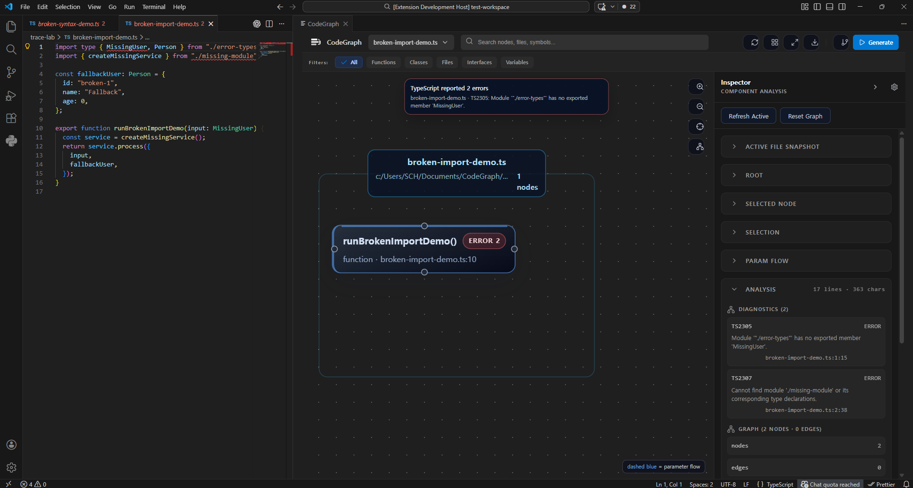
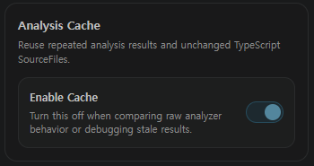

# Cogic

<p align="center">
  
</p>

<p align="center">
  Visualize TypeScript and JavaScript code structure, calls, data flow, framework routes, and runtime context inside VS Code.
</p>

<p align="center">
  <a href="https://github.com/ppsssj/Cogic">GitHub</a>
  ·
  <a href="https://marketplace.visualstudio.com/items?itemName=ppsssj.cogic">VS Marketplace</a>
</p>

---

## Overview

Cogic is a VS Code extension that analyzes the active file and nearby workspace files, then renders an interactive graph of your codebase.

It can show:

- Code entities: `file`, `function`, `method`, `class`, `interface`, `type`, `enum`, `external`
- Relationships: `calls`, `constructs`, `references`, `updates`, `dataflow`
- UI grouping: `folder -> child folder -> file -> symbol`
- Framework semantics for React, Vue, Express, and NestJS

Cogic supports two host modes:

- `Sidebar View`: the Cogic activity bar view inside the VS Code sidebar
- `Editor Panel`: a larger editor-style webview panel

---

## Features

- Active-file and workspace-aware graph analysis
- File, folder, and symbol grouping
- Depth-based graph expansion
- Node selection, double-click navigation, and source range opening
- External node expansion
- Parameter flow highlighting and Inspector integration
- Root file and folder scoping
- Trace mode for understanding how the graph was built
- Runtime Debug mode that maps paused stack frames to graph nodes
- JSON, JPG, and SVG export
- Scaffold Lab for generating files, folders, functions, classes, interfaces, types, and service/repository pairs
- In-memory analysis caching for repeated graph analysis and TypeScript `SourceFile` parsing
- Polished icon-only controls with lightweight hover feedback

---

## Screenshots

### Graph


### Node Navigation


### Trace Mode


### Runtime Debug


### Diagnostics



---

## Commands

- `Cogic: Open Editor Panel`
- `Cogic: Focus Sidebar View`

Command IDs:

- `codegraph.open`
- `codegraph.openSidebar`

Cogic also contributes an Activity Bar container named `Cogic`.

---

## Graph Interaction

- Single click: select a node
- Double click: open the matching source location
- File or folder node selection: reveal actions for focusing the graph from that file or folder
- Canvas controls: zoom in, zoom out, focus selection, and fit graph
- Top bar controls: refresh, layout, export, trace mode, depth, and project/file context

---

## Root And Scope

Cogic can keep the graph anchored while you navigate through files.

- File root: keeps graph refreshes anchored to one file
- Folder root: allows graph refreshes only for files inside that folder

This prevents graph context from changing unexpectedly when you open another file from the graph.

---

## Analysis Cache

Cogic includes an in-memory analysis cache, enabled by default.



The cache stores:

- Full graph analysis results for matching file content, graph depth, trace settings, and workspace file state
- Parsed TypeScript `SourceFile` objects for unchanged disk files
- A short-lived workspace file list cache

Active unsaved editor text is always analyzed from the current editor buffer, so unsaved changes are not replaced by stale disk cache entries.

You can disable the cache with:

```json
{
  "cogic.analysisCache.enabled": false
}
```

---

## Trace Mode

Trace mode shows how the analyzer assembled the current graph.

Trace scopes:

- `Single File`: traces only the current file
- `Current Depth`: traces the current graph depth and keeps the starting file as the trace anchor

Trace mode is useful when validating analyzer behavior or understanding why specific nodes and edges appeared.

---

## Runtime Debug Mode

Runtime Debug mode connects Cogic to the VS Code debugger.

It can:

- Read the current paused stack frame
- Map the frame file and line to a graph node
- Highlight the runtime active node
- Display frame and variable context in the Inspector
- Refresh focus while stepping through code

When a graph root is set, debug-driven graph expansion respects that root.

---

## Export

Cogic supports:

- JSON export with graph, metadata, filters, search, selection, root, and Inspector state
- JPG snapshot export of the rendered graph
- SVG snapshot export of the rendered graph

---

## Scaffold Lab

Scaffold Lab can generate code from graph context.

Folder targets:

- File
- Folder

File targets:

- Function
- Class
- Interface
- Type
- Service + Repository

When a root is selected, Scaffold Lab prefers that root as the target context.

---

## Analyzer Architecture

Core analyzer paths:

- `src/analyzer/analyze.ts`
- `src/analyzer/adapters/`

Framework adapters currently include:

- React: hooks such as `useEffect`, `useMemo`, `useCallback`, `useState`, `useReducer`
- Vue: `computed`, `watch`, `watchEffect`, `ref`, `reactive`, and related updates
- Express: `app.get`, `app.post`, `app.use`, router handlers, and route owner nodes
- NestJS: controller decorators and route owner nodes

---

## Development

Install dependencies:

```bash
npm install
cd webview-ui
npm install
```

Build the webview:

```bash
npm run build:webview
```

Build everything:

```bash
npm run build:all
```

Run tests:

```bash
npm test
```

Package the extension:

```bash
npm run package:vsix
```

Publish to Marketplace:

```bash
npm run publish:marketplace
```

---

## Repository Structure

```text
.
|-- src/                # VS Code extension host source
|-- webview-ui/         # React + Vite webview UI
|-- media/webview/      # Built webview output copied into the extension
|-- assets/             # Logo and demo assets
|-- scripts/            # Helper scripts
|-- package.json
`-- README.md
```

---

## Notes

- Folder grouping is a UI layout layer, not the raw analyzer graph schema.
- Sidebar left/right placement follows VS Code's sidebar position.
- Sidebar and editor panel hosts share the same feature set.
- Framework adapter support is designed to be extended over time.

---

## Roadmap

- Incremental workspace analysis for larger repositories
- More route/controller/service visual emphasis
- Additional export presets
- Additional framework adapters such as Svelte, Fastify, and Next.js server actions

---

## License

This project is licensed under the MIT License. See [LICENSE](LICENSE).
